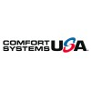

## Partners Real Estate
- *VP of IT* | May'21 - Oct'23
- 
- Tags: Partners Real Estate
- Badges:
  - Leadership [purple]
  - Project Management [green]
  - ERP [red]
  - Software Engineering [blue]
  - End User Services [orange]
- List Items:
  - Developed 5-year competitive technology roadmap directly contributing to the company’s competitive strategy and innovation, review of market options for solutions, management of ground-up technology development initiatives, and interactions between our current professionals and internal clients. 
  - Maintained IT ERP, Infrastructure, and Innovation project programs each with 10 regular active projects overseeing the day-to-day execution of 75 unique technology projects in a 2-year period.  
  - Lead IT Architecture direction company-wide standardizing equipment and decommissioned 98% of on-site infrastructure in favor of cloud-based Software-as-a-service products.  
  - Owned all in-house IT services with full stack frameworks pioneering enhancements and resolving issues. 
  - Negotiated software, hardware, and labor contract details for 130+ company-wide IT solutions and 30+ contractors while reducing annual spend by 15% over a 2-year period. 
  - Established integrations-led ERP solutions with Salesforce and Yardi as backbones, each integrating with 10+ other tools and directly functioning as the operations hub for 2+ independent business lines.  
  - Developed IT talent through independent coaching and presenting opportunities for growth for direct reports as well as fostering subject matter experts with internal resources in the business. 
 

## Control Risks
- *Head of IT Service Delivery - Americas* | Oct'18 - May'21
- 
- Tags: Control Risks
- Badges:
  - Leadership [purple]
  - Project Management [green]
  - ERP [red]
  - Software Engineering [blue]
  - End User Services [orange]
- List Items:
  - Addressed IT practices, aligning policies and performance related to overall change management, process improvement, vendor purchasing (in US, Mexico, Panama, Brazil, and Colombia) and IT service continuity reducing IT service resolution times by 75%. 
  - Centralized data management of company information using SharePoint 365 and Microsoft’s DLP/AIP capabilities. 
  - Minimized global incidents via strong risk management framework to plan software and hardware releases. 
  - Consolidated service desk management of 15+ permanent resources in Panama, quickening average time to resolution on issues by three days globally. 
  - Reduced overall spend by 10% through asset procurement and telecom device management project initiatives with key vendors such as AT&T, Connection.com, Dell, and SHI. 
  - Contributed to IT hardware and architecture discussions directly affecting the Los Angeles and Sao Paulo datacenters. 

## Comfort Systems
- *IT Program Director, ERP/Service Delivery* | May'13 - Oct'18
- 
- Tags: Comfort Systems
- Badges:
  - Leadership [purple]
  - Project Management [green]
  - ERP [red]
  - Software Engineering [blue]
  - End User Services [orange]
- List Items:
  - Supported ERP Solutions: Maxwell, Viewpoint, COINS, Timberline, Penta, OnBase, JD Edwards enabling HVAC Service & Construction operational excellence across 40 brands. 
  - Completed 5 ERP implementations within 2.5 years through iterative capacity planning, environmental setup and feature availability enhancements. 
  - Improved back-office functions and generated $500,000 in cost savings by managing nearly 50 expense-reduction projects, elevating and enhancing effectiveness of 2,000 staff in Accounting, Finance, Procurement, HVAC Service Operations, as well as Construction. 
  - Lead project management efforts for more than 110 projects overseeing implementation 50+ new applications, each with an average user size of 70 or more users.  
  - Mentored technicians and aspiring managers by leveraging their talent and aptitude on important projects and initiatives. This resulted in 8 internal promotions and an extremely empowered workforce. 
  - Personally responsible for IT architecture of company’s hybrid cloud application solutions involving over 50 servers located in Houston and Austin datacenters. 
  - Facilitated IT business mergers by directing infrastructure migration efforts for 6 brands. 
  - Maintained project portfolio for company-wide ERP initiative by negotiating existing contracts with 8 third-party integration tool vendors which allowed funding for three additional major ERP enhancements over a six-month period. 
  - Standardized and improved process flows using a project-based approach for multiple enterprise applications – Dropbox, AutoCAD, Microsoft Office, Sage FAS, Hyperion and external application integrations. 
  - Reduced overall spend by 20% by negotiating existing contracts with eight third-party integration tool vendors which enabled business to fund three additional major ERP enhancements over a six-month period. 
  - Published IT/ERP compliance and policy documents and conducted annual ERP SOX external audits evaluating ERP practices.  
  - Streamlined process for new product feature ideation by leading HVAC Service, Construction, Finance and Acquisition steering committees at corporate and brand locations. 
  - Transformed service delivery in one year: created service level agreements, plus comprehensive IT knowledge base, achieved 96% user satisfaction rate – a 31-point increase – with average issue resolution time of <12 hours. 
  - Established company’s first internal help desk, enabling consistent, reliable nationwide IT user support. 

## Pathway Forensics
- *IT Operations / eDiscovery Consultant* | Apr'12 - Apr'13
- 
- Tags: Pathway Forensics
- Badges:
  - Leadership [purple]
  - Project Management [green]
  - Software Engineering [blue]
- List Items:
  - Maintained more than 50 Windows and Fedora / CentOS servers within VMWare environment, supporting 3TB of litigation data, using PowerShell, Python, Nuix, LexisNexis LAW PreDisovery, and LateralData Viewpoint software. 
  - Leveraged Excel, MSSQL and SQL Server Reporting Services to develop customized litigation review reporting. 
  - Finalized company-wide vendor partnership with Viewpoint Premium Silver Certification, positioning the company as a preferred vendor, eventually securing two major sales relationships.

## Reynolds & Reynolds
- *Business Application Software Developer* | Jan'11 - Oct'11
- 
- Tags: Reynolds & Reynolds
- Badges:
  - Software Engineering [blue]
- List Items:
  - Oversaw complex coding changes within proprietary version control system across project lifecycles.
  - Tackled backlog of feature requests by developing multiple capabilities and functions, including integration of check-printing peripherals with previously unsupported vendors.  
  - Redesigned menu tree dropdowns to achieve 10X more efficient average time calculations of major customer data, integrating new dropdowns in all major POWER software screens – Billing, Finance, Operations, and Sales. 

## SHSU Computer Services
- *Linux / IT Operations Technician* | Aug'08 - Jan'11
- 
- Tags: SHSU Computer Services
- Badges:
  - End User Services [orange]
- List Items:
  - Facilitated major IT projects with Linux Administrator Supervisors, including SAN migration to accelerate data retrieval requests by 50% and Linux Satellite implementation, which centralized distribution of packaged software applications. 
  - Configured applications, services and utilities for RedHat, CentOS and Fedora distributors, including SSHD, Apache, NFS, Iptables, Samba, FTP, Kickstart, Grub, Satellite, Spacewalk, RDP and XMPP. 
  - Elevated responsiveness to routine and critical IT issues for 100 physical servers. Also customized Zenoss monitoring tool, enabling IT analytics tracking and real-time error reporting for 100 physical servers. 